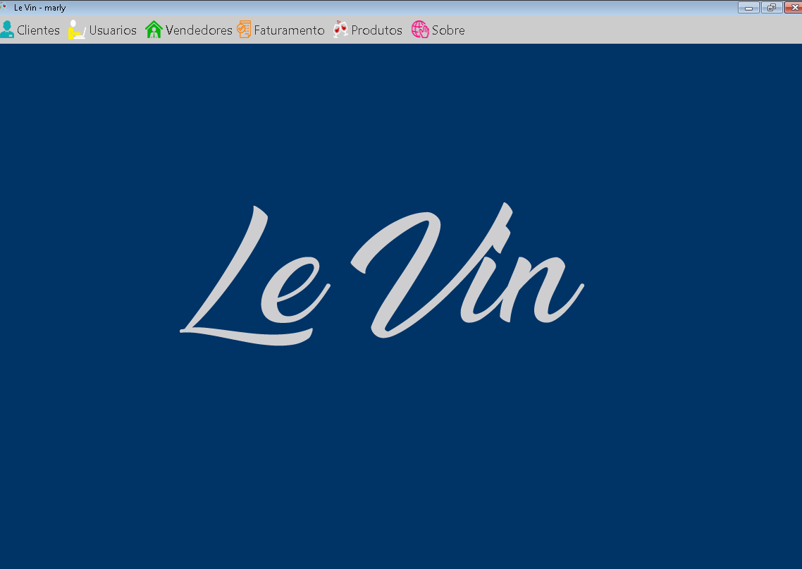
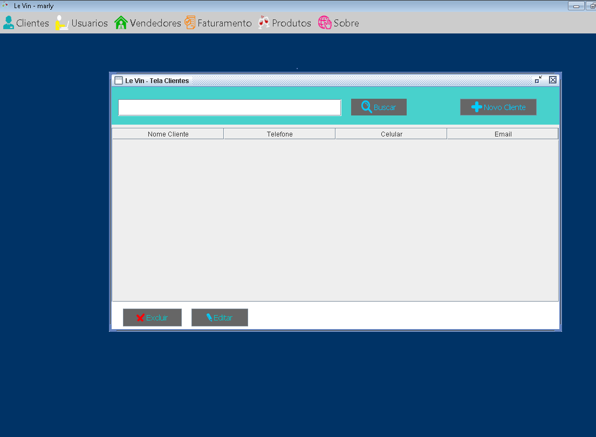

# Le Vin

## Descrição
É um software, feito em java, destinado a uma determinada empresa de vinho. Possui as seguintes funções cadastro, busca, alteração de clientes, produtos, vendedores e pedidos.

## Screenshots da interdace do software
- [Tela Principal] 

- [Tela Faturamento]

- [Tela Busca]

